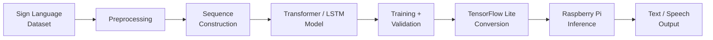
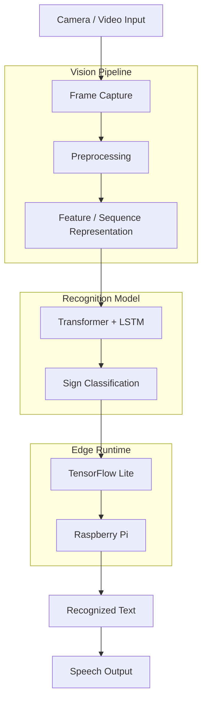
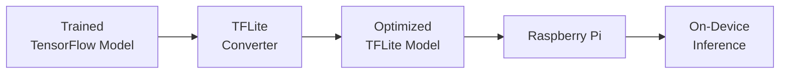
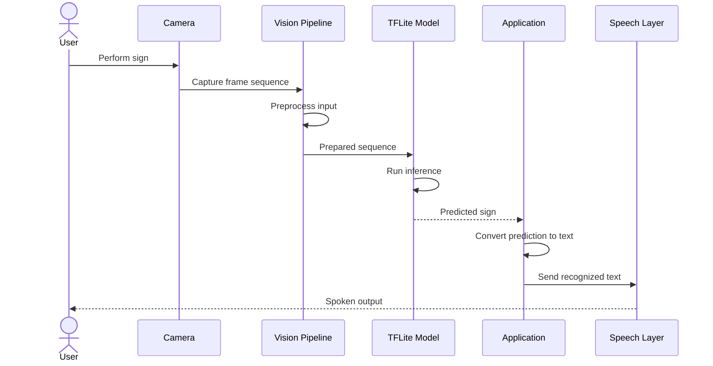

<div align="center">

# Sign2Speech

### Turning sign language into speech — on the edge.

An on-device sign language recognition system that combines **computer vision, sequence modeling, TensorFlow Lite, and Raspberry Pi deployment** to translate visual sign sequences into spoken output.

Built with **TensorFlow, TensorFlow Lite, Transformer/LSTM-based sequence modeling, OpenCV, and Raspberry Pi**.

[Architecture](#system-architecture) · [ML Pipeline](#machine-learning-pipeline) · [Edge Deployment](#edge-deployment) · [Run Locally](#run-locally)

</div>

---

## Why Sign2Speech?

Communication between sign-language users and people unfamiliar with sign language can require an interpreter or specialized accessibility tools.

Sign2Speech explores a different approach:

> **Can sign recognition run directly on a small edge device instead of depending entirely on cloud inference?**

The project combines visual input processing, temporal sequence modeling, model optimization, and on-device inference to build a prototype capable of translating recognized signs into speech.

The focus is not only on training a model — but on taking that model toward a **resource-constrained deployment environment**.

---

## System Preview

<!-- Replace with a real image/GIF from your project -->

<p align="center">
  
</p>

> The strongest demo here would be a short GIF showing  
> **sign → camera capture → prediction → text → speech**.

---

## The Idea

```text
          SIGN LANGUAGE
               │
               ▼
         Camera / Video
               │
               ▼
        Frame Processing
               │
               ▼
      Visual Representation
               │
               ▼
       Temporal Modeling
               │
               ▼
       Sign Classification
               │
               ▼
         Predicted Text
               │
               ▼
        Speech Generation
```

Sign language is inherently temporal.

A gesture cannot always be understood from a single frame — its meaning may depend on how hand position, pose, and movement evolve over time.

That makes the problem a combination of:

**computer vision + sequence modeling + deployment engineering.**

---

## Core Capabilities

| Capability | Description |
|---|---|
| **Sign Recognition** | Predict signs from visual input sequences |
| **Sequence Modeling** | Capture temporal relationships across frames |
| **Transformer / LSTM Modeling** | Model sequential visual information |
| **Computer Vision Pipeline** | Process visual input for inference |
| **TensorFlow Training** | Build and train the recognition model |
| **TensorFlow Lite** | Convert the trained model for lightweight inference |
| **Edge Deployment** | Target Raspberry Pi as a resource-constrained inference device |
| **Speech Output** | Convert recognized signs into spoken output |
| **Local Inference** | Explore recognition without requiring continuous cloud inference |

---

# Machine Learning Pipeline

The project follows the complete path from data to deployment:



This makes Sign2Speech more than a model-training experiment.

The project explores the engineering required to move from:

```text
Dataset
   ↓
Research Model
   ↓
Trained Model
   ↓
Optimized Model
   ↓
Edge Runtime
   ↓
User-Facing Output
```

---

# System Architecture



The architecture separates visual processing, temporal recognition, optimized inference, and output generation.

---

# Why Sequence Modeling?

Individual video frames contain spatial information.

Sign language additionally contains **temporal information**.

Consider a sequence:

```text
Frame 1 → Frame 2 → Frame 3 → ... → Frame N
```

The relationship between these frames can encode:

- movement direction
- gesture progression
- hand transitions
- temporal context
- pose evolution

A sequence model can therefore reason across the gesture rather than treating every frame as an unrelated image.

---

## Model Design

The recognition pipeline explores a combination of **Transformer and LSTM-based sequence modeling**.

Conceptually:

```text
Visual Sequence
      │
      ▼
Feature Representation
      │
      ▼
Transformer
      │
      │ contextual relationships
      ▼
LSTM
      │
      │ temporal information
      ▼
Classifier
      │
      ▼
Predicted Sign
```

### Transformer

The Transformer component helps model relationships between different positions within the input sequence.

### LSTM

The LSTM component is suited to processing sequential information and maintaining temporal context across observations.

Together, they provide a way to reason about both broader sequence relationships and temporal progression.

---

# Edge Deployment

Training a model on a development machine is only one part of the problem.

Sign2Speech also explores:

> **How do you run that model on hardware with significantly fewer computational resources?**

The target deployment platform is a **Raspberry Pi**.

---

## TensorFlow → TensorFlow Lite

The deployment pipeline converts the trained TensorFlow model into a TensorFlow Lite representation.



TensorFlow Lite is designed for inference environments where:

- memory is limited
- compute is constrained
- model size matters
- inference latency matters

This makes it suitable for exploring deployment on edge devices.

---

## Why Edge AI?

A cloud-only architecture might look like:

```text
Camera
   ↓
Upload Data
   ↓
Internet
   ↓
Cloud Model
   ↓
Prediction
   ↓
Device
```

Sign2Speech instead explores:

```text
Camera
   ↓
Edge Device
   ↓
Local Model
   ↓
Prediction
   ↓
Speech
```

Running inference closer to the user can potentially provide advantages such as:

- reduced network dependency
- lower communication latency
- less raw visual data leaving the device
- offline-capable workflows
- predictable inference architecture

Actual performance depends on the deployed model and hardware configuration.

---

# End-to-End Inference

At runtime, the intended workflow is:



This connects the ML model to an actual user-facing workflow rather than stopping at an offline prediction notebook.

---

# Tech Stack

### Machine Learning

`TensorFlow` · `TensorFlow Lite`

### Model Architecture

`Transformer` · `LSTM`

### Computer Vision

`OpenCV`

### Edge Computing

`Raspberry Pi`

### Programming

`Python`

### ML Engineering

`Preprocessing` · `Model Training` · `Model Evaluation` · `Model Conversion` · `On-Device Inference`

---

# Repository Structure

> Replace the names below with the exact repository structure if they differ.

```text
Sign2Speech/
│
├── data/
│   └── ...                 # Dataset / processed data
│
├── preprocessing/
│   └── ...                 # Input preprocessing pipeline
│
├── models/
│   └── ...                 # Model architecture / checkpoints
│
├── training/
│   └── ...                 # Training pipeline
│
├── inference/
│   └── ...                 # Prediction pipeline
│
├── edge/
│   └── ...                 # Raspberry Pi / TFLite inference
│
├── notebooks/
│   └── ...                 # Experiments and analysis
│
├── requirements.txt
└── README.md
```

---

# Run Locally

## Prerequisites

Recommended:

- Python 3.9+
- pip
- TensorFlow
- OpenCV

For edge deployment:

- Raspberry Pi
- TensorFlow Lite-compatible runtime
- camera/input device as required by the application

---

## 1. Clone the repository

```bash
git clone https://github.com/HimanshuMishra-03/Sign2Speech.git

cd Sign2Speech
```

---

## 2. Create a virtual environment

```bash
python -m venv .venv
```

Activate it.

### Linux / macOS

```bash
source .venv/bin/activate
```

### Windows

```bash
.venv\Scripts\activate
```

---

## 3. Install dependencies

If the repository contains `requirements.txt`:

```bash
pip install -r requirements.txt
```

Otherwise install the dependencies required by the current implementation.

---

## Model Optimization

After training, the TensorFlow model can be converted for edge inference using TensorFlow Lite.

The general flow is:

```python
import tensorflow as tf

converter = tf.lite.TFLiteConverter.from_saved_model("saved_model")

tflite_model = converter.convert()

with open("sign2speech.tflite", "wb") as file:
    file.write(tflite_model)
```

> Use the repository's actual conversion script if one already exists.

---

# Measuring Edge Performance

For an edge ML project, accuracy alone is not enough.

Useful deployment metrics include:

| Metric | Why It Matters |
|---|---|
| **Validation Accuracy** | Measures recognition performance |
| **Model Size** | Determines storage and memory requirements |
| **Inference Latency** | Determines responsiveness |
| **FPS / Throughput** | Indicates real-time processing capability |
| **Memory Usage** | Important on constrained hardware |
| **Quantization Impact** | Measures optimization vs model-quality trade-offs |

One of the next goals for this repository is to document these metrics from the actual Raspberry Pi deployment.

---

# Engineering Challenges

## 1. Temporal information

Signs are sequences rather than isolated images.

The model therefore needs to capture information across multiple observations.

---

## 2. Resource constraints

A model that works well on a development machine may not be practical on an edge device.

Deployment introduces additional constraints around:

```text
Accuracy
   ↕
Latency
   ↕
Model Size
   ↕
Memory
```

The goal becomes finding a useful engineering trade-off rather than optimizing only one metric.

---

## 3. Bridging ML and an actual application

A trained model alone does not produce an accessible system.

The complete workflow requires:

```text
Input
  ↓
Preprocessing
  ↓
Inference
  ↓
Prediction Handling
  ↓
Text
  ↓
Speech
```

Each stage affects the usability of the final application.

---

# What I Learned

Sign2Speech pushed the project beyond model training and into **ML systems engineering**.

The major areas explored include:

- computer vision preprocessing
- sequence modeling
- Transformer architectures
- LSTMs
- TensorFlow model development
- TensorFlow Lite conversion
- model optimization
- edge-device constraints
- Raspberry Pi deployment
- real-time inference considerations
- connecting ML predictions to user-facing software

Most importantly, it reinforced that:

> **A model isn't finished when training ends — it's finished when it can operate inside the system it was designed for.**

---

# Future Work

Some directions worth exploring:

- benchmark inference latency directly on Raspberry Pi
- document model-size reduction after optimization
- evaluate quantization strategies
- add confidence-based prediction filtering
- improve temporal smoothing
- expand supported sign vocabulary
- evaluate performance across different lighting conditions
- improve background robustness
- add real-time FPS monitoring
- investigate MediaPipe-based landmark representations
- compare Transformer/LSTM architecture variants
- evaluate additional edge hardware
- add automated model evaluation
- package the inference pipeline as a standalone application

---

# Project Status

Sign2Speech is an experimental **ML + edge AI project** exploring sign-language recognition and resource-constrained deployment.

The project should be treated as a prototype rather than a production accessibility or interpretation system.

---

## Repository

https://github.com/HimanshuMishra-03/Sign2Speech

---

<div align="center">

### Train on the machine. Optimize for the edge. Build for the person.

An exploration of computer vision, sequence modeling, and on-device machine learning.

</div>
